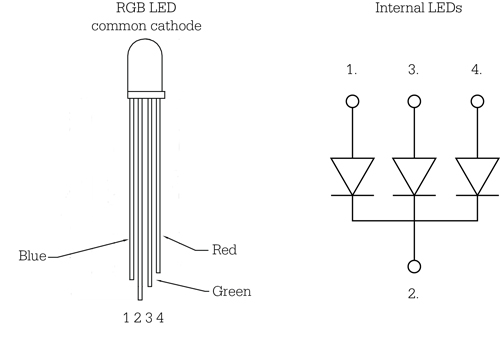
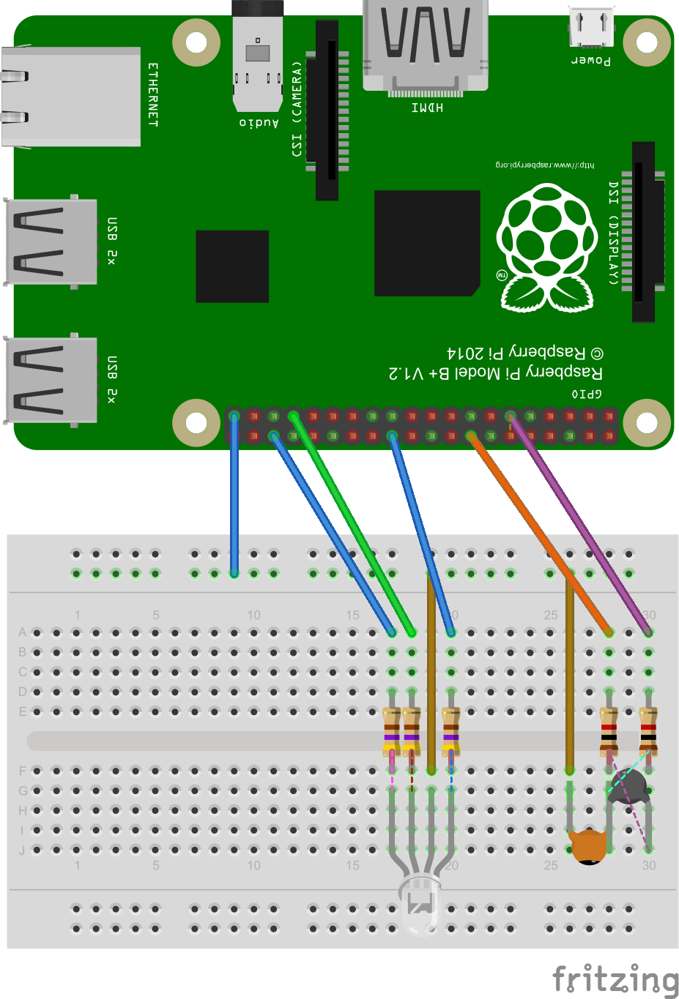
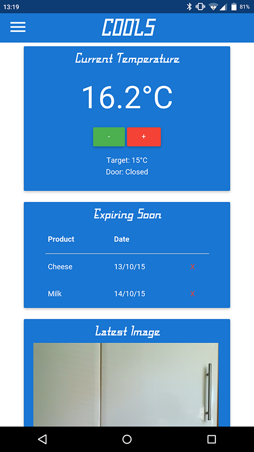

University of Strathclyde

CS413 ACE Group 7 - ACE Phase 1

Group Members: Scott Henderson, Andrew Mortimer, Alex McBride, Daniel Rafferty and Paul McGurk

----

# Contents  
  - [Introduction](#introduction)  
  - [Assessment of Capabilities](#assessment-of-capabilities)  
    - [Requirements](#requirements)
    - [Arduino](#arduino)
    - [Raspberry Pi](#raspberrypi)
    - [Choice](#choice)
  - [Software Design](#software-design)
    - [Operating System](#operating-system)
    - [Accessing the Hardware](#accessing-the-hardware)
    - [Web server](#web-server)
      - [Why use a web server?](#why-use-a-web-server?)
      - [Technology stack](#technology-stack)
    - [Temperature Measurement](#temperature-measurement)
    - [Barcode Scanning](#barcode-scanning)
    - [Touchscreen Interface](#touchscreen-interface)
  - [Current Progress](#current-progress)
  - [Conclusion](#conclusion)

----

# Introduction
The project is to create a product using either an Arduino and/or Raspberry Pi that will be a part of the Internet of things. The Internet of things is about taking everyday objects and embedding them with software, electronics and networking capabilities so that they can sense the environment around them and then send and receive data. The idea, after much thought and discussion will be to create a smart fridge. This idea will not only have a physical benefit to its application but also an environmental one, as from the start the design is centred on trying to reduce food waste and energy consumption.

----

# Motivation
According to statistics from http://www.lovefoodhatewaste.com/content/facts-about-food-waste-1 (a website run by WRAP - Waste and Resources Action Programme) UK households throw away 7 million tonnes of food every year. One of the main reasons for this is not using the food before it goes out of date. The average cost per household of this food wastage is £470 per year.
#### Environmental Impact
The same website claims that if this food wastage was reduced to 0, it would be equivalent to taking a quarter of the cars in the UK off the road. According to studies from WRAP (http://www.lovefoodhatewaste.com/content/love-your-fridge-and-waste-less) by ensuring our fridges are at the right temperature (between 0 and 5°C), as a country there is a potential of £200 million to be saved. Apprently, 70% of fridges are kept too warm, meaning food becomes inconsumable much more quickly.
#### Our goal
By allowing the temperature of the fridge to be changed remotely, as well as alerting a user when foods are soon to be out of date, we hope to reduce food waste and reduce the environmental impact of this.

# Assessment of Capabilities
## Requirements
The device must be able to support a touchscreen, have a thermometer connected, camera to act as barcode scanner, wireless capabilities and be able to run a web server.

## Arduino

The Arduino Uno V3 is a small microcontroller board sporting an ATmega328p processor. It is designed for prototyping embedded products and as a result has good support for driving ICs and other low-level peripherals. The 6 PWM outputs allows analogue components to be operated easily, and the lean 16MHz processor is extremely low power meaning it could potentially be powered from a battery.

|                     |   Arduino Uno V3  |
|---------------------|-------------------|
| Microcontroller     | 16 MHz ATmega328P |
| SRAM                | 2KB               |
| Flash Memory        | 32KB              |
| USB 2.0             | None              |
| HDMI                | None              |
| Audio output        | None              |
| Digital I/O pins    | 14                |
| Analogue input pins | 6                 |

## Raspberry Pi

The Raspberry Pi is a small form-factor ARM based computer. It is a very popular system that has a healthy development ecosystem. The RPi can run a custom Linux-based operating system, called Raspbian, allowing fairly high level development and integration with lower-level peripherals such as GPIOs. The Raspberry Pi also has official peripherals or "modules" for devices such as a camera or a touchscreen.

There are several models of Raspberry Pi available:

|                | Raspberry Pi Model A                                 | Raspberry Pi 2                  |
|----------------|------------------------------------------------------|---------------------------------|
| CPU            | 700 MHz Low Power ARM1176JZ-F Applications Processor | 900MHz quad-core ARM Cortext-A7 |
| RAM            | 256MB                                                | 1GB                             |
| Ethernet port  | None                                                 | Yes                             |
| USB 2.0        | 1 port                                               | 4 ports                         |
| HDMI           | Full HDMI port                                       | Full HDMI port                  |
| Audio output   | 3.5mm audio jack                                     | 3.5mm audio jack                |
| Number of GPIO | 17                                                   | 40                              |

## Choice

We have chosen to go for the Raspberry Pi 2. The reason we chose a RPi over an Arduino was that we needed the higher performance that the RPi line offers in order to serve our web pages and do the barcode scanning in software. Furthermore we wanted internet connectivity and we felt this would be easier to achieve in the Linux based Pi. The reason we chose to use the model 2 instead of the model A was the better connectivity for peripherals in terms of USB ports and available GPIOs, with the higher performance an added bonus.

## Hardware Design
#### Main Parts
##### RGB LED
An RGB LED (Red Green Blue Light Emitting Diode) is a small light which has three different diodes within it, capable of emitting three types of light. Each pin controls a different colour, with the longest pin being the PLUS. Using PWM (Pulse Width Modulation), we can dim and lighten the different colours to give a range of colours. The operating temperatures are also well within the range of the fridge.

This is being used within the project as a visual display of the temperature of the fridge, which Blue representing when the temperature is near the ideal temperature, and red when at room temperature.

| Colour | Wave Length | Forward Voltage | Forward Current | Luminosity | Operating Temperature |
|--------|-------------|-----------------|-----------------|------------|-----------------------|
| Red    | 623nm       | 2.0V            | 20ma            | 2800mcd    | -25 ~ 85°C            |
| Green  | 517.5nm     | 3.2V            | 20ma            | 6500mcd    | -25 ~ 85°C            |
| Blue   | 466nm       | 3.2V            | 20ma            | 1200mcd    | -25 ~ 85°C            |

##### Resistors
A resistor is a device which reduces the flow of current within a circuit. This can be used to protect elements from high current, as well as other things.

This is being used within the project to protect the RGB LED, and within the temperature part of the circuit to work out the resistance of the themistor (see below).

| Value | Quantity |
|-------|----------|
| 1kΩ   | 2        |
| 470Ω  | 3        |

##### Thermistor
A themistor is a resistor which is sensitive to temperature. The resistance of the thermistor is used to work out the temperature of it's surroundings using a variety of different math techniques, notably the Steinhart–Hart equation.

This is being used within the project to work out the temperature within the fridge, allowing us to monitor it in real-time.

###### Thermistor symbol

| Value         | Quantity |
|---------------|----------|
| 1kΩ (at 25°C) | 1        |

##### Capacitor
A capacitor is a device which stores electrical energy temporary.

This is used within the project to work out the temperature of the fridge, which is done by measuring how long it takes to empty, with the resistance of the thermistor being dependent on temperature.

###### Capacitor symbol

| Value | Quantity |
|-------|----------|
| 330nF | 1        |

##### Raspberry Pi Camera
The Raspberry Pi Camera Board connects to any Raspberry Pi or Compute module and allows for high definition photography. It has several useful features, including: high data capability, 5 mega-pixel fixed focus, support of 1080p, 720p60 and VGA90. It also has automatic control functions including white balance, exposure control, luminance detection.
The Pi Camera Board has a 15cm ribbon cable which slots into the Pi Camera Serial Interface Port. Via Raspbian, there are several applications that can be used to take photos, including Raspistill.

| Technical Specifications        |                 |
|---------------------------------|-----------------|
| Dimensions                      | 8.5 x 8.5 x 5mm |
| Maximum frame rate capture      | 30fps           |
| Maximum supported resolution    | 2592 x 1944     |
| Supported Bus Interfaces        | I2C             |
| Supported Video Ports           | Raspberry Pi    |
| Minimum Operating Temperature   | -30°C           |

The minimum operating temperature of -30°C means we could mount the camera inside the fridge if we so desire.

This will be used within the project to scan the barcode of the products being entered into the fridge. It could possibly automatically detect the use-by date as well.

##### Raspberry Pi Touch Screen Display

The Raspberry Pi 7" Touchscreen Display connects to a raspberry pi, and allows it to display graphics in a self contained package. It also allows the user to interact with the GUI through touch, ommiting the need for additional peripherals such as mouse and keyboard.

We choose this screen as others were seen as too small to be able to display a useful amount of information, and too small to be able to allow the user to type on.

| Technical Specifications        |                      |
|---------------------------------|----------------------|
| Dimensions                      | 194mm x 110mm x 20mm |
| Viewable screen size            | 155mm x 86mm         |
| Screen resolution               | 800 x 480            |

This will be used within the project to display a custom GUI which will have a number of uses, such as; display all products which are near their use-by date, adding custom products (homemade food, products which do not scan properly, etc). From this screen, the user will also be able to see the temperature of the fridge, and possibly change the temperature within the fridge, if that is implemented.

#### Component List
| Quantity | Component Name             | Price/Unit | Total Price |
|----------|----------------------------|------------|-------------|
| 1        | Raspberry Pi Touch Screen  |  £         |  £          |
| 1        | Raspberry Pi Camera        |  £         |  £          |
| 1        | 330nf Capacitor            |  £         |  £          |
| 1        | RGB LED                    |  £         |  £          |
| 1        | Thermistor                 |  £         |  £          |
| 2        | 1kΩ Resistor               |  £         |  £          |
| 3        | 470Ω Resistor              |  £         |  £          |
|          |                            |            |             |
|          |                            |  Total     |  £          |
<!-- TODO: magnets? that type of stuff for this -->
#### Prototype Circuit

##### Result
<!-- TODO: keep this? -->

----

## Software Design
#### Operating System
[Raspbian](https://www.raspbian.org/) is a Linux Debian-based operating system which is designed to run on a Raspberry Pi. It optimizes full power of the Linux desktop environment for the Raspberry Pi's hardware. It allows us to focus on writing the functionality of the software that is unique to our smart fridge, leveraging the rich software ecosystem of 35000 packages that are offered by Raspbian to implement some of the more "standard" technologies such as the web server.
#### Accessing the hardware
[RPi.GPIO](https://pypi.python.org/pypi/RPi.GPIO) is a library that allows high level access to the GPIOs on the board through python bindings. Since we currently do not have plans to utilize the hardware PWM, SPI, or I2C functionalities we are not limited by the fact that RPi.GPIO does not support these. If we choose to use any of these functionalities then we can implement them in C and call down from python fairly easily.

#### Web server
##### Why use a web server?
Most of the functionality of our project requires us to have an interface to the fridge to administrate and view information. We have chosen to go with a web-based approach, with the RPi itself hosting the web server. Going with this approach allows us to write the client application once and access it from a phone or a desktop without having to write client applications directly for each.
##### Technology stack
Since the RPi.GPIO library provides access to the GPIOs via Python, we thought it prudent to serve the dynamic content of our application from Python also. We will achieve this using the [Flask](http://flask.pocoo.org/) framework. Flask features a web server and a templating engine to allow us to write static HTML with wildcards that allow us to dynamically insert relevant data. Although none of us have had any experience with this technology before, we thought it was a natural fit and do not anticipate much trouble in utilizing it.
#### Temperature Measurement
blah

#### Barcode Scanning
##### Barcode Scanning Library
[Zbar](http://zbar.sourceforge.net/) is an open source barcode reading library that supports a wide range of barcode formats. It has Python bindings allowing us to read the barcodes in Python.
##### Identifying Products using the Barcode
[Outpan](https://www.outpan.com/) is a web service that provides an API for identifying products from their GTIN. It is free to use and has a database of millions of products. We can make simple HTTP requests with the barcode we just scanned and get information such as the name of the product back.
#### Interface
##### Touchscreen
The touchscreen interface will be written in HTML5, JavaScript and CSS3, using the Materialize CSS for the visuals. As for the keyboard for entering data, we will use [matchbox keyboard](https://github.com/xlab/matchbox-keyboard).

##### Mobile
The mobile interface will also be written in HTML5, JavaScript and CSS3, again, using the Materialize CSS library.

This interface will be similar to the touchscreen interface, visually, but will not be able to add products, at least, to begin with.

----

## Current Progress
Our excellent group organisation has allowed us to have already made good progress on Phase 1 of our project. To begin with, we have researched all of the necessary components to complete our project, including deciding on a Raspberry Pi 2 as the basis for our embedded system. We have also created a demo to sense temperature and change the colour of an LED using this Pi, as this is one of the main features of our project. Another feature that we have already implemented is a Flask web server running on the Pi. Flask will give us an easy way to store data and check the values of the sensors remotely via a web interface. We have also planned a prototype that will allows us to identify the major challenges in our design/software before moving onto the final build of our project. The basis of a web interface has been created to allow a user to view/change temperature, display current contents of the fridge, including expiration dates, and also to show the latest image from the PI camera.

----

## Conclusion

We have outlined a solid plan to go forward and start developing our smart fridge. By staying as organised as we have been so far, we should meet all the deadlines (submission ones as well as ones we have set ourselves) with no trouble. Building a smart fridge will be very interesting, not only because we will have a useful product by the end of the project, but also because of the environmental implications. By being able to regulate the temperature of the fridge, as well as alerting a user if the door has been left open, we will ensure the fridge will use the least amount of power possible. Secondly, by giving the user an obvious visual representation of which foods are going out of date soon, there is the hope that this will reduce food wastage. Furthermore, it is generally a useful system which will be applicable to the real world. We look forward to making good progress, and our strong group dynamic will allow us to overcome any obstacles with minimal stress.
